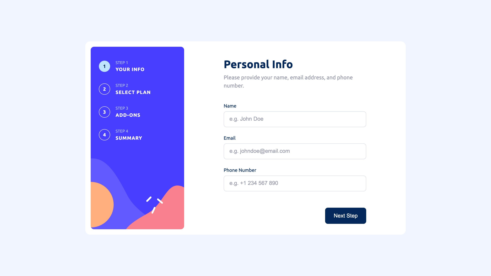

# Frontend Mentor - Multi-step form solution

This is a solution to the [Multi-step form challenge on Frontend Mentor](https://www.frontendmentor.io/challenges/multistep-form-YVAnSdqQBJ). Frontend Mentor challenges help you improve your coding skills by building realistic projects.

## Table of contents

- [Overview](#overview)
  - [The challenge](#the-challenge)
  - [Screenshot](#screenshot)
  - [Links](#links)
- [My process](#my-process)
  - [Built with](#built-with)
  - [What I learned](#what-i-learned)
  - [Continued development](#continued-development)
- [Getting started](#getting-started)
  - [Prerequisites](#prerequisites)
  - [Installation](#installation)
- [Author](#author)

## Overview

### The challenge

Users should be able to:

- Complete each step of the sequence
- Go back to a previous step to update their selections
- See a summary of their selections on the final step and confirm their order
- View the optimal layout for the interface depending on their device's screen size
- See hover and focus states for interactive elements
- Receive form validation messages when required fields are missing or contain invalid data

### Screenshot



### Links

- Solution URL: [GitHub Repository](https://github.com/edwardshanahan97/frontend-mentor-multi-step-form)
- Live Site URL: [Live Site](https://edwardshanahan97.github.io/frontend-mentor-multi-step-form/)

## My process

### Built with

- Semantic HTML5 markup
- CSS custom properties
- Flexbox
- CSS Grid
- Mobile-first workflow
- React
- Vite

### What I learned

One of the main things I learned during this project was that React components can be stored in an array and assigned to a variable. I used this to control which form step is rendered based on the current step:

```jsx
const steps = [PersonalInfo, Plan, AddOns, Summary, Confirmation];

const CurrentStep = steps[currentStep - 1];

return (
  <CurrentStep
    setCurrentStep={setCurrentStep}
    formData={formData}
    setFormData={setFormData}
  />
);
```

This kept the step rendering logic simple and avoided having multiple conditional checks for each component.

### Continued development

I would like to continue improving the UI of this project to more closely match the Figma design across different screen sizes.

## Getting started

### Prerequisites

- Node.js
- npm

### Installation

Clone the repository:

```bash
git clone https://github.com/edwardshanahan97/frontend-mentor-multi-step-form.git
```

Navigate to the project directory:

```bash
cd frontend-mentor-multi-step-form
```

Install the dependencies:

```bash
npm install
```

### Run locally

Start the development server:

```bash
npm run dev
```

Open the local URL shown in the terminal.

### Create a production build

```bash
npm run build
```

## Author

- Frontend Mentor - [@edwardshanahan97](https://www.frontendmentor.io/profile/edwardshanahan97)
- GitHub - [@edwardshanahan97](https://github.com/edwardshanahan97)
